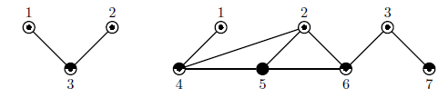

[TOC]


# 补充题解 - 《经典》- 第 8 章高效算法设计


## 习题 8-3 　 比特变换器（ Bits Equalizer, SWERC 2012, UVa12545）

首先要忽略S和T中已经相同的位置。分别记录以下4种情况出现的次数:

1. S[i] = 0, T[i] = 1, 记为s01.
2. S[i] = 1, T[i] = 0, 记为s10.
3. S[i] = ?, T[i] = '0', 记为q0.
4. S[i] = ?, T[i] = '1', 记为q1.

记所求结果为ans = 0, 首先尽量将s01和s10中的位置进行互换，记x = min(s01, s10)，则:

``` cpp
ans = x + q0, s01 -= x, s10 -= x
```

此时如果s10 > q1，参考如下的情况，因为此时只能由'?'变成0，于是就无法产生足够的'0'，返回-1即可。

```tex
1111????
00001100
```

否则可以先把?变成0，然后再和s10中的1进行交换即可。

最后，ans += s10+s01+q1。具体含义就是如下操作的次数之和，参考如下的情况:

```reStructuredText
11????
001100
或者
00????
111100
```

- 0->1
- ?->0 之后和 1->0 交换
- ?->1

## 习题 8-7 生成排列（ Generating Permutations, UVa11925）
输入 一个 1 ～ n（ 1 ≤ n ≤ 300） 的 排列， 用不 超过 2n2 次 操作 把 它 变成 升序。 操作 只有 两种： 交换 前 两个 元素（ 操作 1）； 把 第一个 元素 移动 到 最后（ 操作 2）。 例如， 输入 排列 为 4, 2, 3, 1， 一个 合法 操作 序列 为 12122， 具体 步骤 是： 4231- ＞ 2431- ＞ 4312- ＞ 3412- ＞ 4123- ＞ 1234。

> 8-7 构造过程就是证明


## 习题 8-9 Graph Oddity, ACM/ICPC NEERC 2010, UVa1613
输入一个n（ 3 ≤ n ≤ 9999）个 点 m条边（ 2 ≤ m ≤ 100000）的连通 图， n 保证为奇数。 设k为最小的奇数， 使得每个点的度数不超过k， 你的任务是把图中的结点涂上颜色1～k， 使得相邻结点的颜色不同。 多解时输出任意解。 输入保证有解。 

如下图所示， k=3。


【分析】

首先建图的时候就可以顺路求出k。然后不难想到使用BFS，每次遍历到一个结点u，看看K个颜色中，有哪些已被与u相邻的结点使用。在剩下的颜色中选择一个使用即可。

下面我们考虑证明这个做法的正确性。

记最大度数结点为u，u的度数为D。如果D为偶数，那么显然k种颜色都是足够的。

如果D为奇数，并且和u相邻的点的颜色各不相同，只有和D连接的所有结点v，都互相连接形成完全图的情况下，k种颜色才不够用，此时每个v的度数都已经为D。那么不能再连接除了这个完全图中的其它结点，所以u和其相邻的所有v就形成了整张连通图，图的结点个数就是D+1为偶数，与n为奇数矛盾。所以k种颜色一定是够用的。

## 习题8-10 奇怪的股市(Hell on the Markets,ACM/ICPC NEERC 2008, UVa1614)
输入一个长度为n（n<=100000）的序列a，满足1<=ai<=i，要求确定每个数的正负号使得所有数的总和为0。比如a={1, 2, 3, 4}，则设四个数的符号分别是1, -1, -1, 1即可（1-2-3+4=0），但如果a={1, 2, 3, 3}，则无解（输出No）。

【分析】

本质上是要把序列划分成两组，两组的绝对值之和相等。记$S=\sum_{i=1}^n a_i$。则显然当S为奇数时，问题无解。

按照i从小大访问$a_i$，取出部分作为一组，记录当前取出部分之和为T，则$2\cdot(T+a_i)\leq S$则取出$a_i$，否则不取。

然后考虑证明上述算法的正确性：考虑最靠左的没被取的$a_i$以及在取$a_{0\to i-1}$之前的T。那么有：
$$
T+a_i> {S \over 2}  \\
\Longrightarrow i \geq a_i>{S \over 2} - T \\ 
\Longrightarrow T+ i - 1 \geq {S \over 2 }
$$
而且根据题意有：
$$
a_i \geq 1 \Longrightarrow T + \sum_{k=1}^{i-1}a_k \geq {S \over 2}
$$
而且根据算法描述有:
$$
T+ \sum_{k=1}^{i-1}a_k \leq {S \over 2}
$$
所以有: 

$$T+ \sum_{k=1}^{i-1}a_k= {S \over 2}$$。

也就是最终取到的数字之和一定为S/2。

## 习题 8-12 Keep the Customer Satisfied, ACM/ICPC SWERC 2005,UVa1153

