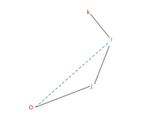

[TOC]


# 补充题解 - 《经典》- 第 9 章动态规划初步

## 习题 9-7 Locker, Tianjin 2012, UVa1631

记初始数字序列为S[0,N)，目标序列为T[0,N)

每次转动可以选择选择相邻的1到3个。那么从左到右决策每一位时同时考虑相关的3位，具体来说设$D(i,d_0,d_1,d_2)$为$[i,N)$区间的每一位还未考虑，(i, i+1, i+2)三位上的数字分别是$d_0,d_1,d_2$，还需要的最少转动次数。

则状态转移方法如下:

1. $i = N-1$时，$D = min((d_0 - T_{N-1} + 10) \mod 10, (T_{N-1} - d_0 + 10) \mod 10)$，其实就是看看把$d_0$转动到$T_{N-1}$的上下两个方向哪种转动次数更小。
2. $d_0 = T_i $时，$D = D(i+1, d_1, d_2, S_{i+3})$。
3. 考虑往T上转k = $(T_i -d_0 + 10) \mod 10$次，则i+1, i+2位往上转的次数$k_1, k_2$就是满足$k\geq k_1 \geq k_2 \geq 0$的所有情况，针对每种情况 $D(i, d_0, d_1, d_2) = min(D(i, d_0, d_1, d_2), k + D(i+1, up(d_1, k_1), up(d_2, k_2)))$。其中up(a,b)表示数字a朝上转b得到的数字：$(a+b) \mod 10$。
4. T往下转k的情况同理。

则所求结果就是：$D(0, S_0, S_1, S_2 )$。

## 习题9-13 叠盘子(Stacking Plates, ACM/ICPC World Finals 2012, UVa1289)

【分析】by 陈锋

假设进行了x次split操作; 则两种操作共需要x+x+n-1次，因为进行一次split操作,连通块的个数就会增加1个; 进行x次的话,就有x+n块; 然后把这x+n块合并成一块的话; 需要x+n-1次join操作; 再加上x次split操作; 总共就是2x+n-1次操作。

为方便讨论，我们给初始的n堆盘子染上不同的颜色，那么最终完成后，肯定是由不同的颜色组成。假设上下相邻的盘子之间颜色不同的出现次数为c，因为有c个不同的颜色，那么分离次数x就是c-(n-1)，答案就是2c-n+1。

对上述的c进行DP。首先要将盘子直径进行离散化处理，因为盘子的最大直径有10000，而数量最多为2500。而且同一堆中的盘子，如果直径相同，完全可以当成是一个盘子。

记F(d,i)为直径0到d的所有盘子形成一堆且底部盘子颜色为i时，最小的色彩切换次数。则状态转移方法如下：

```c++
  for(auto i : C[0]) F[0][i] = C[0].size()-1;
  for(d = 1; d < DC; d++){         // DP d: 一堆盘子中最大盘子的直径
    int cc = C[d].size();          // 直径d有多少种颜色
    for(auto j : C[d]){            // 最底下一层盘子的颜色
      int &f = F[d][j];
      for(auto k : C[d-1]){        // 最下面一个直径d-1的盘子颜色
        if (j != k) // 不同的颜色盘子之间有cc次转换，如果颜色k有直径为d的，则可以把它最上边减少一次转换次数
          f = min(f, F[d-1][k] + cc - HasD[k][d]);
        else                       // 同色的两个底部盘子之间有多少次转换?
          f = min(f, F[d-1][k] + (cc == 1 ? 0 : cc)); 
      }
    }
  }
```

则最终一堆盘子的最小颜色切换次数为min(F(maxd, i)), i in [0,N)。分析完成。

## 习题9-16 野餐(The Picnic, ACM/ICPC NWERC 2002, UVa1634)

【分析】by 陈锋

首先针对所有的点按照从左到右，从下到的顺序进行排序。

然后枚举凸包的最靠左靠下的点O，然后将O作为原点，O右方或者正上方的点按照逆时针排序。针对这些点求凸包。这样在O左下方的点就肯定不在凸包内部。记剩下的点个数为M。

对于剩下的M个点，考虑凸包中编号最大的两个点i,j(i<j)，记F(i,j)为所有都在三角形oij左上方的顶点和oij形成的合法凸包的最小面积。而且没有任何点在三角形oij内时，ij才能作为凸包的合法边。

ij固定之后，对i,j前面的最后一个顶点k进行枚举，这个点k必须满足，k,i,j能够形成凸边，然后F(i,j) = max(F(i,j), S(oij) + F(k,i))。其中S(oij)为三角形o,i,j的面积。



算法的时间复杂度为，$O(N^3)$。

## 习题9-17 佳佳的筷子(Chopsticks, UVa 10271)

【分析】by 陈锋

本题实际上是需要在N个数字中，选出K+8组。每一组有三个数A≤B≤C，使得所有组的$(A-B)^2$的和(下文称为费用)最小。不难想到对N个数字进行非递增排序，则最优方案中的任意两个A,B一定是在排序结果中相邻的。

定义D(i,j)为从前i个筷子中选出j组的最优费用。则对是否选择(i-1, i)作为A,B形成一组进行决策。能够选择的前提是i >= 3j，这样才可以在前i个元素中，任意选择一个作为C。最终所求结果为D(N,K+8)。

## 习题9-20 山路（Mountain Road, NWERC 2009, UVa12222） 

【分析】by 陈锋

整个的行驶过程一定是两个方向交替着开过一些车，可以用D(i,j,d)表示从左到右开了i辆车，反方向开过去了j辆车，最后一辆车的方向为d(0: 从左到右，1:从右到左)。则最终的答案为min(D(An, Bn, 0), D(An, Bn, 1))，其中An和Bn分别为两个方向的车的数量。则采用递推法来计算所有的D值：

```cpp
int AN, BN, N, D[MAXN][MAXN][2];
int solve(){
  _init(D, 0x7f);
  D[0][0][0] = D[0][0][1] = 0;
  _rep(i, 0, AN) _rep(j, 0, BN){
    int st = D[i][j][1], ed = 0;          // i个左->右, j个右->左，最后一个右->左
    _rep(k, i+1, AN){  // 枚举接下来有哪些车从左->右
      st = max(st, A[k].t);               // 车进入的时间，需要等上个车走了之后
      ed = max(st + A[k].d, ed);          // 车离开的时间
      D[k][j][0] = min(D[k][j][0], ed);
      st += 10, ed += 10;                 // 两车间隔10秒钟
    }
    st = D[i][j][0], ed = 0;
    _rep(k, j+1, BN){
      st = max(st, B[k].t);
      ed = max(st + B[k].d, ed);
      D[i][k][1] = min(D[i][k][1], ed);
      st += 10, ed += 10;
    }
  }
  return min(D[AN][BN][0], D[AN][BN][1]);
}
```


## 习题9-21 周期（Period, ACM/ICPC Seoul 2006, UVa1371）

【分析】by 陈锋

B的长度不大于50，所以最大的周期肯定也不大于50。可以在0到50之间二分答案K。记D(i,j)为A[0, i]至少需要多少次操作才能转换成B[0, j]，如果不考虑K次限制的话，则状态转移方程为:
> D(i,j) = min(D(i-1,j-1) + (A[i] == B[j]),  D(i-1,j)+1, D(i, j-1)+1)。

而加入K次的限制以及周期考虑之后，在D(i, |B|) <= K时，设置D(i, 0) = 0，表示可以重新开始考虑。DP的值可以使用递推求出：
```cpp
void update(int i, int j, int val){ D[i][j] = min(D[i][j], val); }

bool valid(int K){
  _init(D, 0x7f);
  D[0][0] = 0;
  _rep(i, 0, N){
    if(D[i][M] <= K) D[i][0] = 0;
    _rep(j, 0, M){
      int d = D[i][j];
      update(i+1, j+1, d+(A[i+1] != B[j+1]));
      update(i, j+1, d+1), update(i+1, j, d+1);
    }    
  }
  return D[N][M] <= K;
}
```

## 习题9-22 俄罗斯套娃（ Matryoshka, ACM/ ICPC World Finals 2013, UVa1579） 

【分析】

如果问题有解，最终完成之后，一定是把整个区间切割成多个子区间，然后分别套成套娃组。每个子区间一定是由1~L的前L个正整数组成，我们称这样的区间是OK的，其中L是区间的长度。所以不难想到如下的状态转移方程：
$$
D_i=min\{D_j + S_{i, j}\}, [i,j)是OK的。
$$
其中$D_i$表示将[i,n)区间套成套娃组所需的最小次数，所求结果就是$D_0$，边界条件是$D_n=0$。初始所有$D_i= \infty $

下面考虑$S_{i,j}$，$S_{i,j}$表示将[i,j)区间套成一组所需要的最小次数。[i,j)区间不一定是OK的。下面我们来考虑计算$S_{i,j}, i < j$。

不难想到其状态转移方程，$S_{i,j}=min \{S_{i,k}+S_{k,j}+C_{i,k,j}\}, i<k<j$。其中$C_{i,k,j}$表示将[i,k)和[k,j)两个区间各自形成的套娃组，打开重新套起来形成一个新的套娃组所需要的操作次数。

怎么求$C_{i,k,j}$呢，举例来说，考虑[1,2,5], [3,4]这两个子区间，3,4,5三个都是要打开然后再关上的，那么不难总结出一般规律，考虑同在一个子区间中的最小的a个数字，则操作次数为$C_{i,k,j} = i-j-a$。

具体来说，每个区间是否OK可以提前预处理出来，时间复杂度为$O(n^2)$。计算$S_{i,j}$的复杂度为$O((i-j)^2)$。总体的时间复杂度为$O(n^3)$。

## 习题 9-23 优化最大值电路（ Minimizing Maximizer, ACM/ICPC CERC 2003, UVa1322）

【分析】

每个Sorter可以看做一个子区间，则本题需要求的就是从m个输入的子区间中选择一个最小的子集，这个子集中的子区间可以将[1,n]完全覆盖。

定义D(i)为将区间[1,i]完全覆盖所需要的最小的Sorter个数。则D(1) = 0。D(i) = min(D(j) + 1)，存在某个区间S满足：S包含j，且S的右端点为i。所求结果为D(n)，直接计算的时间复杂度为O(n*m)，对于本题的输入规模来说太慢了。可以考虑使用线段树来优化查询和修改速度：

将D[1…n]存储到一颗线段树中，初始设D(1) = 0, 其它D(i) = INF。则对于每个输入区间S[l, r]，首先使用线段树查询出[l…r]中的最小值d，之后更新D[r] = d+1即可。这样总的时间复杂度就变成O(logn·m)。