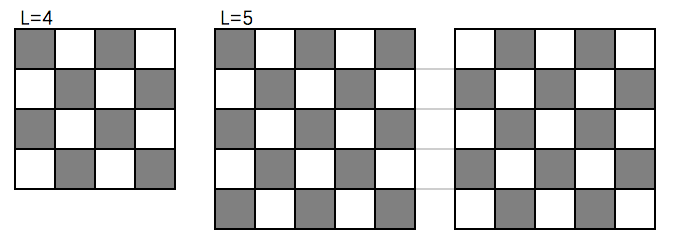

[TOC]


# 补充题解 - 《经典》- 第 10 章数学概念与方法

## 习题10-14 标准差 Standard Deviation, UVa10886

不难想到简单的暴力解法，考虑标准差的计算公式：
$$
{1\over n}\sum_{i=1}^n (x_i - m)^2  =  {1\over n}\sum_{i=1}^n x_i^2-{2m\over n}\sum_{i=1}^n x_i+m^2\\
={1\over n}\sum_{i=1}^n x_i^2-m^2 \quad 其中 \ m = {\sum_{i=1}^nx_i \over n}
$$
但是这样时间效率并不是很高，即使AC，也是勉强通过。

思考一下有无有更好的办法，随机数生成器最容易出现重复问题。所以我们可以做个试验，使用hash判重(unordered_map)，就会发现在g = 0或者$g=2^{32}$之后就开始所有的g都一样。 g = 0之后的所有输出都是0，g = $2^{32}$的所有输出都是$2^{32}$了。实际上回到题面看的也很容易发现将这两个数字代入之后，所有的seed就永远是固定的数字了，之后就不需要继续循环，直接计算结果并返回即可。

## 习题 10-21 二项式系数 Binomial coefficients, ACM/ICPC NWERC 2011, UVa1649

对于固定的k，${n}\choose{k}$是相对于n单调递增的，不难想到使用对n使用二分来寻找所有等于m的${n}\choose{k}$。

但是这里存在一个问题，计算${n}\choose{k}$并且和二分查找中的mid比较时很容易溢出，有的同学考虑用浮点数，但是存在误差问题，并且计算速度较慢。不过可以考虑利用递推公式：${{n}\choose{k}} = {n-k+1\over n}{{n}\choose{k-1}}$，递推计算，每次先除以${{n}\choose{k-1}}$和$n$的最大公约数，之后n一定能被$n-k+1$整除，这样一旦大于mid，直接返回结果即可。

但是即使这样仍然可能会乘法时溢出，怎么办呢，使用另外一个技巧：
$$
a*b > 2^{63} \leftrightarrow a > 2^{63}/b
$$
这样在可以在乘法之前就检测溢出，而且m一定是小于$2^{63}$的，如果发现即将溢出，就可以确定要计算的值一定是大于m的，可以直接返回比较结果。

## 习题 10-24 幂之和(Sum of Powers, UVa766)

$$
(n+1)^{k+1}-n^{k+1}=\sum_{0≤i≤k}{k+1 \choose i}n^i \\
n^{k+1}-(n-1)^{k+1}=\sum_{0≤i≤k}{k+1 \choose i}(n-1)^i \\
... \\
2^{k+1}-1^{k+1}=\sum_{0≤i≤k} {k+1 \choose i} \cdot 1^i\\
$$
令 $F_k=\sum_{i=1}^ni^k$, 对上以上公式求和可得: 

$$
(n+1)^{k+1}-1 = \sum_{0\leq i \leq k}{k+1 \choose i} F_i \\
(k+1) \cdot F_k = (n+1)^{k+1}-1- \sum_{0\leq j < k} {k+1 \choose j}F_j=\sum_{1≤j≤k+1} {k+1 \choose j} \cdot n^k - \sum_{0≤i<k} {k+1 \choose i} F_i
$$

这样就可以从i = 0到k从小到大一次性全部递推计算出来。

注意本题是要求有理数结果，所以可以使用有理数类来完成四则运算:

```cpp
struct Rational {
  LL a, b;  // a/b
  Rational operator+(const Rational& r) {
    if (r.a == 0) return *this;
    LL na = a * r.b + b * r.a, nb = b * r.b;
    Rational ans = {na, nb};
    return ans.reduce();
  }
  Rational operator-(const Rational& r) {
    if (r.a == 0) return *this;
    Rational ans = {a * r.b - b * r.a, b * r.b};
    return ans.reduce();
  }
  Rational operator/(LL x) {
    assert(x);
    Rational ans = {a, b * x};
    return ans.reduce();
  }
  Rational operator*(LL x) {
    Rational ans = {a * x, b};
    return ans.reduce();
  }
  Rational& reduce() {
    LL g = gcd(a, b);
    a /= g, b /= g;
    return *this;
  }
};
```

## 习题 10-25 因子(Factors, ACM/ICPC World Finals 2013, UVa1575)

对于一个整数k来说，考虑其素数分解$k=p_1^{e_1}\cdotp_2^{e_2}\cdot\cdots p_m^{e_m}$。则$f(k)={(e_1+e_2+\cdots e_m)! \over e_1!e_2!\cdots e_m!}$。实际上与$p_1, p_2 \cdots p_m$无关。要求出最小的k, 那么就可以令$p_1, p_2 \cdots p_m$分别等于最小的素数，然后对$e_1, e_2 \cdots e_m$依次进行回溯，其中$e_i < 63$。计算f(k)时可能溢出，所以要提前算出所有可能的$e_i<63$的素因子分解，使用《经典》一书中 例题 10- 3 　 选择 与 除法（ Choose and Divide, UVa10375）中介绍的方法来计算f(k)。

## 习题10-26 方形花园(Square Garden, UVa12520)

如果想得到最大周长，则显然各个涂色格子之间的公共边越少越好。根据L的奇偶性分情况讨论。

L为偶数时(下图以L=4为示例)，如果 $n \leq {L^2 \over 2}$，则可以做到每个涂色格子均无公共边，所求周长为4*n



如果$n > {L^2 \over 2}$， 则需要考虑涂在哪里损失最小，如上图所示，首先考虑涂在角上的2个白色格子，涂色之后周长不变。接着考虑涂在边上的白色格子，每吐一个格子周长减少2。如果还有未涂色的，就只能涂在不靠边的白格子内，每凃一个周长减少4。

L为奇数时，参考上图中的L=5，则要分两种情况考虑，细节逻辑请参考L为偶数的情况。

## 习题 10-27 互联(Interconnect, ACM/ICPC NEERC 2006, UVa1390)

仔细思考之后不难发现，当前图的状态只需要考虑连通分量的个数以及每个连通分量的大小。

假设当前已经有了k个连通分量，考虑当前每个连通分量的点的个数$C_i$，则数组S=C[0,1,…k]可以作为一个整体来考虑，状态转移时，所有可以连的边有$n\cdot (n-1)$个，而其中能让连通分量个数减少的有$\sum_{0\leq i,j\leq k, i \neq j}C_i\cdot C_j个$。记D(S)为所求的让所有点连通的期望操作次数，$S_{ij}$为i,j所在的分量连通之后的行程的新的状态,  p,e分别为通过一次操作让S长度减少1的概率以及数学期望。

则有:
$$
e = \sum_{0\leq i,j\leq k, i \neq j}{1\over n(n-1)}C_iC_j (1+D(S_{ij})) 
$$

$$
p = \sum_{0\leq i,j\leq k, i \neq j}{1\over n(n-1)}C_iC_j \\
D(s) = e + (1+D(s))*(1-p) \to  D(s)  = {e\over p} + {(1-p) \over p} \\
$$

边界情况就是当len(S) = 1时，D(S)=0。

下面考虑最坏情况下的时间复杂度，有k个连通分量的状态点的个数就相当于把整数n切分成k个数字形成一个无序集合的方案个数，其实这个数字就是2类 Strirling Nubmer。对于这个数字的讨论已经超越《经典》的范围，有兴趣的读者可以参考《具体数学》的相关章节。但是在本题中，实际上只会遍历到极少一部分的状态空间，所以以上算法的速度还是比较快的。如果读者有更精确的推导证明，请联系笔者。

## 习题10-35 Fibonacci Word, ACM/ICPC World Finals 2012, UVa1282

P在$F_n$中出现，只有3种情况：在$F_{n-1}$中；在$F_{n-2}$中；一部分在$F_{n-1}$的结尾，另一部分在$F_{n-2}$的开头。不难想到使用记忆化搜索，记$D_n$为P在$F_n$中出现的次数, L为P的长度，则状态转移方程为:
$D_n = D_{n-1}+D_{n-2} + \sum_{i=1}^{L-1}(F_{n-1}以P_{0\cdots i}结束且 F_{n-2}以P_{i+1 \cdots  L-1}开始)$。

边界条件为: 

$len(F_n) < L \to D_n=0$

$len(F_n) = L \to D_n = [F_n= P]$

那么下一步的关键就是要判断$F_n$是否以指定的字符串开始。这个很容易根据$F_n$的递归特性写出递归判断的算法。判断$F_n$是否以指定的字符串开始的逻辑类似。详情参见本题代码。上述DP算法的时间复杂度为$O(n\cdot L^2)$。

事实上，本题还有更简洁的解法，详情参见ACM/ICPC的官方题解。

## 习题10-46 抽奖(Honorary Tickets, UVa11895)

### 分析

对于一个初始有L个奖，信封个数为T的箱子来说，抽过一次之后剩余有奖信封的期望个数是：$(L-1)\cdot {L\over T} + L \cdot {T-L \over T}={L\cdot(T-1) \over T}$

因为题目要求输出有理数，一般地，对于一个期望有奖信封个数为p/q的箱子来说，抽过一次后有奖信封的期望个数是$p\cdot(T-1) \over T\cdot q$。因为每个人都足够聪明，都会选择当前有奖概率最大的箱子来取，而获奖概率就等于$p\over qT$，可以用一个priority_queue来维护所有的箱子，并且维护当前抽奖概率最大的箱子。模拟K-1次抽奖操作，抽完后更新其期望p/q，之后直接输出当前获奖概率最大的箱子的获奖概率即可。

有几个细节注意：p,q需要用long long来维护，概率比较时牵涉到除法，可以引入浮点数进行比较。

## 习题10-48 考试(Exam, ACM/ICPC Chengdu 2012, UVa1655)

### 分析
ab|x≤n，可以转化为求合法的符合abc ≤ n的(a,b,c)方案数。

考虑有序的(a,b,c)，其中a≤b≤c。那么$1≤a≤n^{1\over 3}$，固定a之后，b满足$a \leq b \leq \sqrt{n \over ba} $。a,b固定之后，c的范围就是$b\leq c \leq {n \over ab}$。合法的a,b,c数对个数要分情况讨论：

1. a<b时，如果b=c，符合要求的c有一个，对应的合法的a,b,c无序方案有3种: (b,c,a), (a,b,c), (b,a,c)；b<c时，c有${n \over ab}-b$个，a,b,c有6种排列。所以对应的合法方案有$6({n \over ab}-b)+3$种。
2. a=b时，如果b=c，符合要求c有一个，对应的方案有1种。b<c时，c有${n \over ab}-b$，a,b,c有3种排列。对应的合法方案有$3({n \over ab}-b)+1$种。

关键部分代码如下:

```c++
LL ans = 0;
for (LL a = 1; a * a * a <= N; a++) {      // 1 ≤ a ≤ N^(1/3)
    for (LL b = a; b * b <= N / a; b++) {  // a ≤ b ≤ sqrt(N/a)
        LL c = N / (a * b);                // b ≤ c ≤ N/ab
        if (c < b) break;
        if (a < b) {
            ans += 3;            // b = c, 2 3 3, 3 2 3, 3 3 2
            ans += 6 * (c - b);  // b < c < N/ab
        } else {               // a = b
            ans += 1;            // b = c, 2 2 2
            ans += 3 * (c - b);  // b < c < N/ab
        }
    }
}
printf("Case %d: %lld\n", kase, ans);
```


