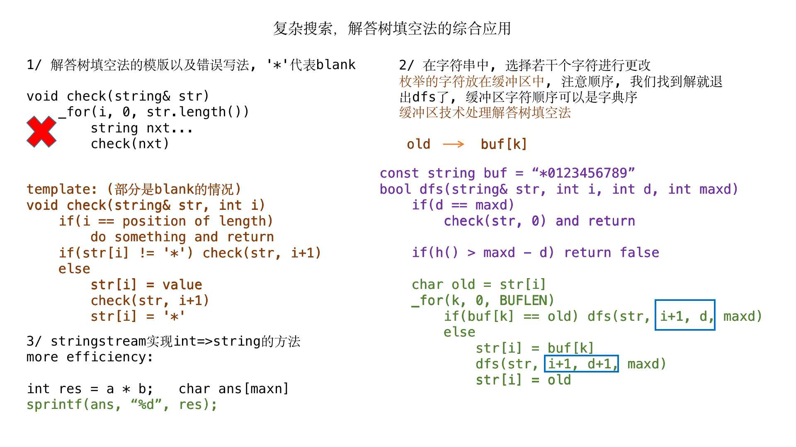
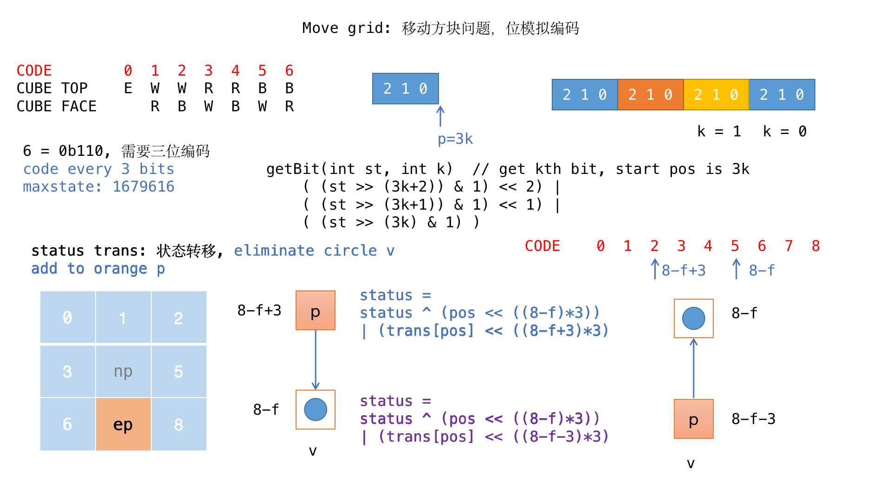
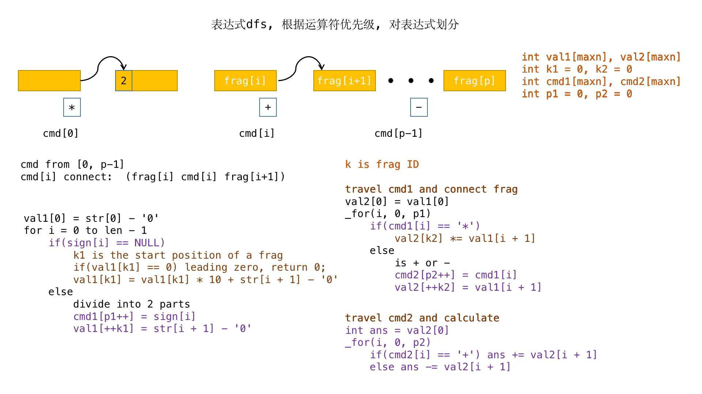
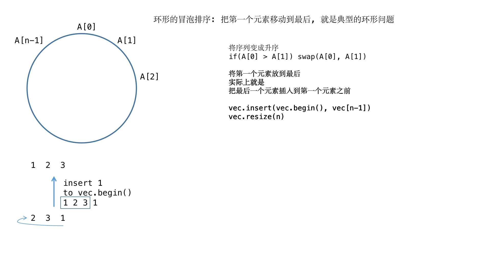
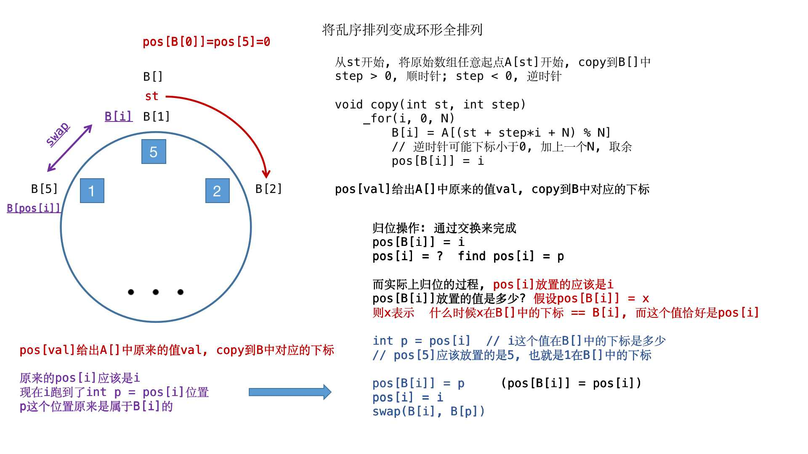
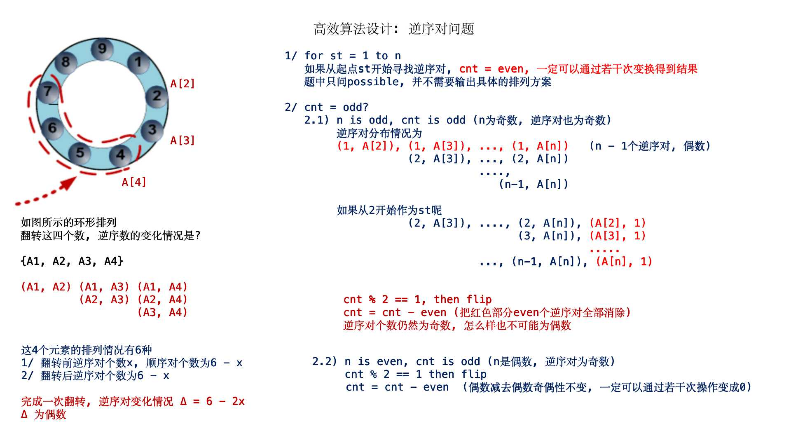
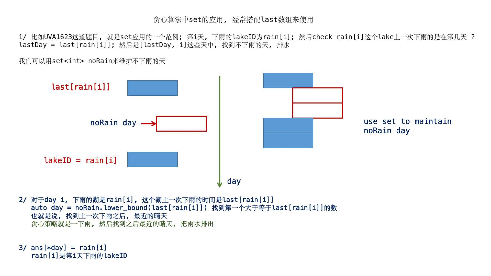

# 贡献代码 #

## 陈章敏 ##

### 第7章 暴力求解法 ###

#### [习题 7- 7 　 埃及分数（ Eg[ y] ptian Fractions (HARD version), Rujia Liu' s Present 6, UVa 12558）](https://vjudge.net/problem/UVA-12558) ####

**[cpp代码](./zhangminchen/ch07/UVA12558.cpp)**

#### [习题 7- 8 　 数字谜（ Digit Puzzle, ACM/ ICPC Xi' an 2006, LA3784）](https://vjudge.net/problem/UVALive-3784) ####

**思路: IDA 解答树填空法**

**[cpp代码](./zhangminchen/ch07/LA3784.cpp)**

#### [习题 7- 9 　 立体八数码问题（ Cubic Eight- Puzzle , ACM/ ICPC Japan 2006, POJ3131）](http://poj.org/problem?id=3131) ####

这道题目的优化我做了好久，具体的[优化方式](https://www.fogsail.net/2019/07/23/20190723/)

最简单的方式是使用位运算模拟
这里需要bfs控制搜索深度

**[cpp代码](./zhangminchen/ch07/POJ3131.cpp)**

#### [习题 7-13 数字表达式（According to Bartjens, ACM/ICPC World Finals 2000, LA5217）](https://vjudge.net/problem/UVALive-5217) ####

**[cpp代码](./zhangminchen/ch07/LA5217.cpp)**

### 第8章 高效算法设计 ###

#### [习题 8- 7 　 生成 排列（ Generating Permutations, UVa11925）](https://vjudge.net/problem/UVA-11925) ####

**[cpp代码](./zhangminchen/ch08/UVA11925.cpp)**

**这里可以引出一种思想：过滤排序**

#### [习题 8- 13 　 外星人 聚会（ Meeting with Aliens, UVa10570）](https://vjudge.net/problem/UVA-10570) ####

**[cpp代码](./zhangminchen/ch08/UVA10570.cpp)**

#### [习题 8- 15 　 笔记本（ Laptop, ACM/ ICPC Daejeon 2012, LA5845）](https://vjudge.net/problem/UVALive-5845) ####

**[cpp代码](./zhangminchen/ch08/LA5845.cpp)**

#### [习题 8- 25 　 有向 图 D 和 E（ From D to E and back, UVa11175）](https://vjudge.net/problem/UVA-11175) ####

**[cpp代码](./zhangminchen/ch08/UVA11175.cpp)**

#### [习题 8- 20 　 懒惰的苏 珊（ Lazy Susan, ACM/ ICPC Danang 2007, LA4000）](https://vjudge.net/problem/UVALive-4000) ####

**[cpp代码](./zhangminchen/ch08/LA4000.cpp)**

#### [习题 8- 22 　 机器人（ Robot, ACM/ ICPC Beijing 2006, LA3660）](https://vjudge.net/problem/UVALive-3660) ####

**[cpp代码](./zhangminchen/ch08/LA3660.cpp)**

#### [习题 8- 23 　 神龙喝水（ Enter the Dragon, ACM/ ICPC CERC 2010, LA4977）](https://vjudge.net/problem/UVALive-4977) ####

**[cpp代码](./zhangminchen/ch08/LA4977.cpp)**

#### [习题 8- 27 　 海盗的宝箱（ Pirate Chest, ACM/ ICPC World Finals 2013, LA6401）](https://vjudge.net/problem/UVALive-6401) ####

**[cpp代码](./zhangminchen/ch08/LA6401.cpp)**

#### [习题 8- 28 　 打结（ Knots, ACM/ ICPC ACM/ ICPC Jakarta 2012, LA6043）](https://vjudge.net/problem/UVALive-6043) ####

**[cpp代码](./zhangminchen/ch08/LA6043.cpp)**